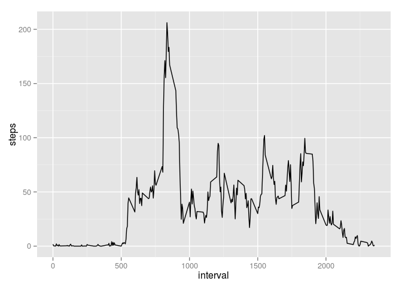
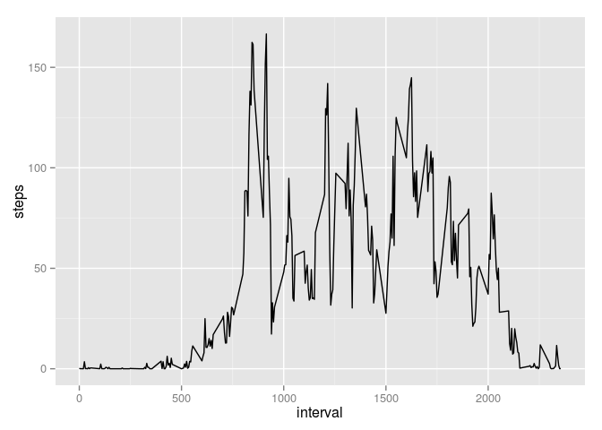

# Reproducible Research: Peer Assessment 1


## Loading and preprocessing the data

```r
activity <- read.csv("activity.csv")
activity <-transform(activity, myDate = as.Date(date,"%Y-%m-%d"))
```


## What is mean total number of steps taken per day?

```r
steps_by_day <- aggregate(activity$steps, by = list(activity$date), FUN=mean)
mean(steps_by_day$x, na.rm =TRUE)
```

```
## [1] 37.3826
```

```r
median(steps_by_day$x, na.rm =TRUE)
```

```
## [1] 37.37847
```

## What is the average daily activity pattern?

```r
steps_interval <- aggregate(steps~interval, data = activity, mean)
library(ggplot2)
with(steps_interval,
qplot(interval,steps,  geom=c("line")))
```

 


## Imputing missing values
No NAs in interval column:

```r
count_interval_NAs <- sum(is.na(activity$interval))
count_interval_NAs 
```

```
## [1] 0
```
No NAs in data column:

```r
count_date_NAs <- sum(is.na(activity$date))
count_date_NAs
```

```
## [1] 0
```
Only NAs in step column:

```r
count_step_NAs <- sum(is.na(activity$steps))
count_step_NAs
```

```
## [1] 2304
```
Input missing data with the mean of the corresponding 5 minute interval

```r
fixed_activity <- transform(activity, meansteps = subset(steps_interval, interval==interval,steps))
step_NAs <- is.na(activity$steps)
fixed_activity$steps[step_NAs] <- fixed_activity$steps.1[step_NAs]
```
## Are there differences in activity patterns between weekdays and weekends?

Plot for activity pattern during week.

```r
weekd <- weekdays(fixed_activity$myDate,abbreviate=T)
fixed_activity <- transform(fixed_activity, day = ifelse(weekd %in% c("So","Sa"),"Weekend", "Weekday"))
steps_interval_weekday <- aggregate(steps~interval, data = subset(fixed_activity,day=="Weekday"), mean)

with(steps_interval_weekday,
qplot(interval, steps,  geom=c("line")))
```

 

```r
steps_interval_weekend <- aggregate(steps~interval, data = subset(fixed_activity,day=="Weekend"), mean)
```


Plot for activity pattern at weekend.


```r
with(steps_interval_weekend,
qplot(interval,steps,  geom=c("line")))
```

 


